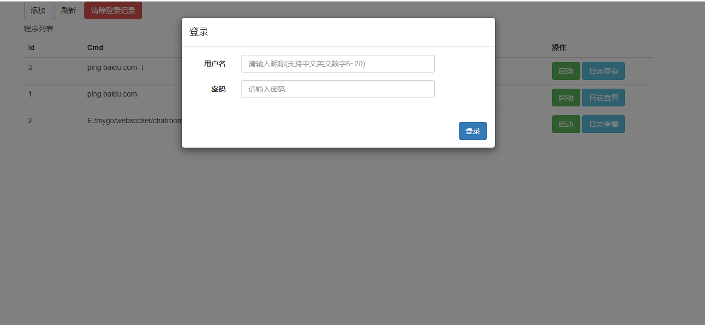
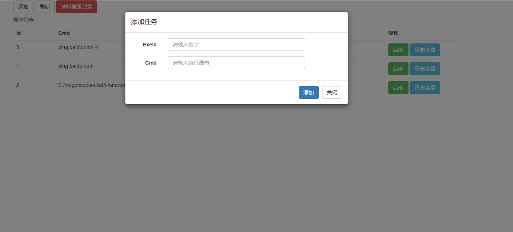
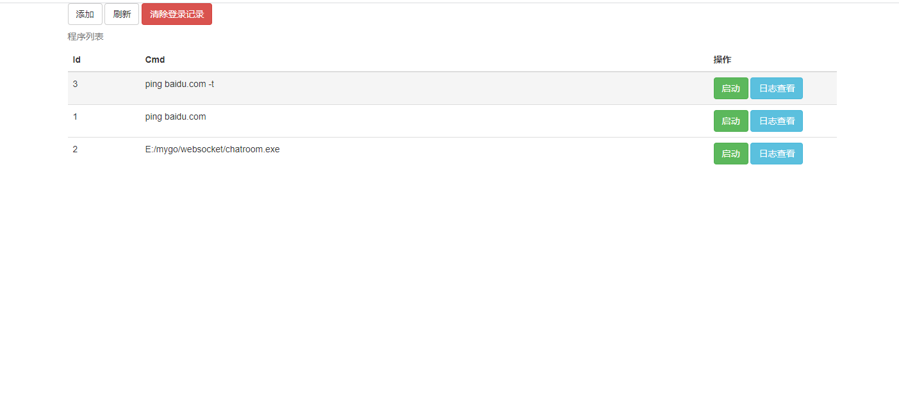
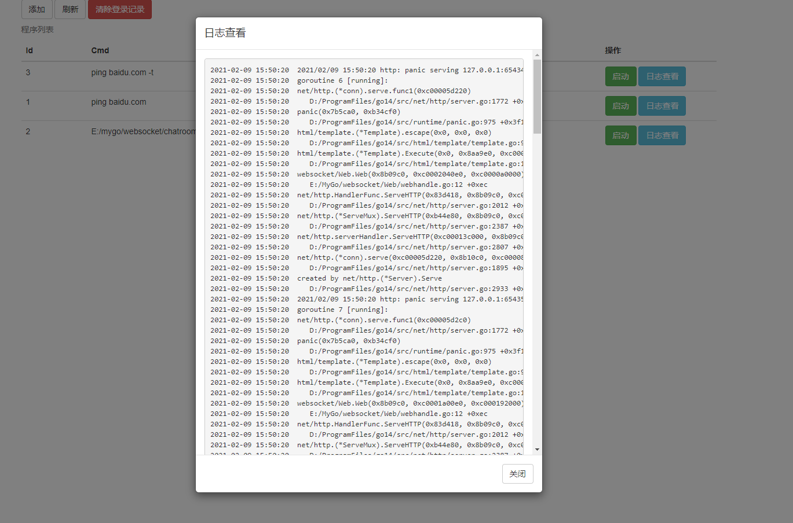

# gomonitor
golang 后台程序执行管理系统
默认首页http://127.0.0.1:5556/
默认用户admin,123456
## 目的
为了不登录服务器，通过浏览器管理服务器上需要常驻后台执行的程序，svn推送更新代码后重启程序以及执行日志查看。

## ui界面
### 登录界面

### 任务添加

### 任务列表

### 任务日志

## 常用地址
列表  
http://192.168.9.60:5556/exelist  
添加已改为post
http://192.168.9.60:5556/addexe?exeid=1&cmd=ping baidu.com  
执行  
http://192.168.9.60:5556/startexe?exeid=1&op=start  
停止  
http://192.168.9.60:5556/startexe?exeid=1&op=stop  

## 更新日志
* 1.0 20200201 基本功能
* 1.1 20200209 ui界面，日志功能，程序列表持久化